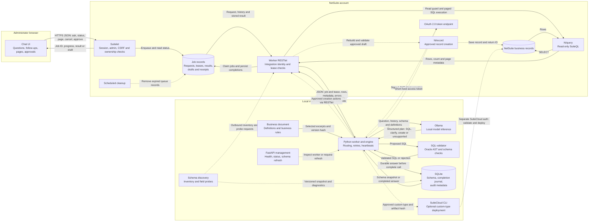
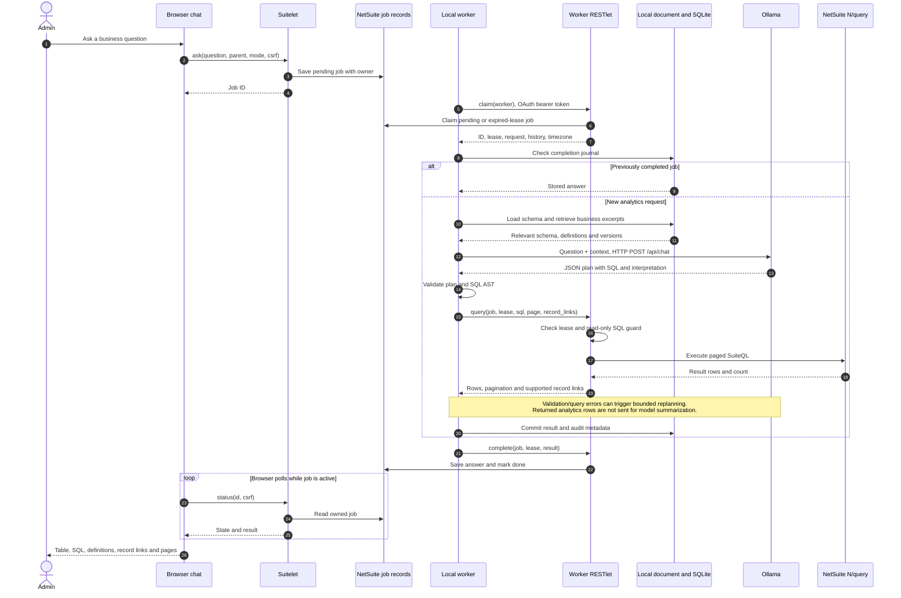
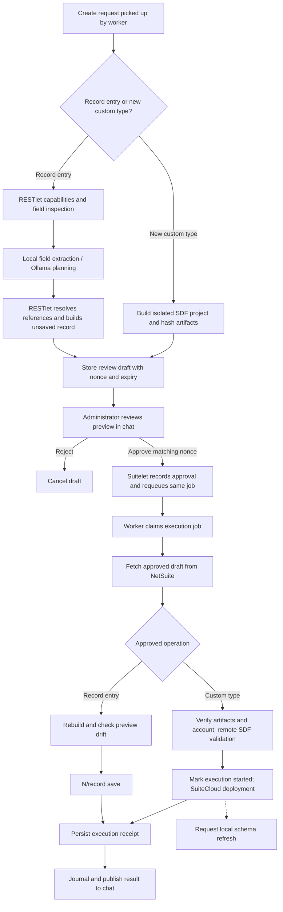

# NetSuite Local Agent — system design

This diagram describes the implementation in this repository. NetSuite hosts the chat, queue, and business data. A local Python worker pulls jobs, uses local Ollama inference, and calls NetSuite to execute validated operations. All connections between the worker and NetSuite are initiated locally; no inbound tunnel is required.

## 1. Components and communication

Arrows show data flow; response arrows do not imply an inbound connection to the laptop. Dashed arrows are supporting or optional paths.

The browser talks only to the NetSuite Suitelet. The local FastAPI service is a management interface, not the chat backend. In Docker, port `8765` is bound to localhost and Ollama is reachable on the private Compose network at port `11434`.

## 2. One analytics request, end to end

The browser polls job status every 3 seconds. The worker waits 5 seconds between loop iterations by default and renews an active job's 120-second lease every 25 seconds. These are independent loops; responses do not use WebSockets or server push.

A follow-up creates another job linked to its parent. Up to four earlier turns supply questions and interpretations, not prior analytics row sets. A page request creates a new job that revalidates the original SQL and queries NetSuite again without model planning. Pages are live queries, not a frozen database snapshot.

## 3. Optional creation and approval

Execution uses the stored approved draft, not a fresh model-generated execution payload. Creation and SDF require their respective feature flags and account permissions. SuiteCloud uses its own configured authentication, separate from RESTlet OAuth. If a save/deployment outcome is uncertain, the system requires reconciliation rather than promising exactly-once execution. Cancellation is blocked after execution has started.

## 4. What data moves and where it lives

- **Browser → Suitelet:** question, mode, parent/source job, page number, or approval nonce; the NetSuite session and CSRF token protect these requests.
- **Worker → RESTlet:** JSON containing `action`, worker ID and operation fields. Job operations carry the job ID and lease. HTTPS uses an OAuth bearer token obtained using a certificate-signed JWT assertion; the private key stays local.
- **Worker → Ollama:** the analytics question, recent interpretation history, selected schema, business-document excerpts, timezone and relevant repair errors. Creation planning uses capability/field metadata and requested values. Ollama returns structured JSON; it does not execute database operations.
- **NetSuite → worker → job record → browser:** actual result rows, count/page metadata, SQL, interpretation, definitions, version hashes and supported record links. Analytics figures come from NetSuite execution.
- **NetSuite job records:** temporary questions, state, owner, leases, results, drafts, approvals and execution receipts. These are separate from business records.
- **Local SQLite:** schema snapshots/status, durable completed answers and audit events. Audit events contain metadata; the completion journal can contain business result data.
- **Local files:** business definitions, credentials and optional SDF artifacts/logs. Business definitions are reloaded for each question and selected by deterministic retrieval; this implementation has no vector database.

## 5. Background work and failure handling

- Schema discovery calls RESTlet inventory and probes. Cold start waits for an initial usable snapshot; later refreshes run in the background while the worker serves the last good snapshot. The default refresh interval is one hour; analytics reject snapshots older than twice the configured interval. Failed probes remain visible as partial coverage.
- SQL validation checks the parsed statement against discovered schema before execution. A second RESTlet guard limits execution to reads, and NetSuite applies the integration identity's permissions.
- The worker checks cancellation/lease loss through heartbeats. Expired read-job leases can be reclaimed. The SQLite completion journal allows completed answers to be republished after interruption without rerunning inference; an interrupted read before journaling can run again.
- One worker per integration deployment is supported. A local process lock prevents duplicate workers using the same data directory.
- Local retention purges old completions and audit events; the NetSuite scheduled cleanup removes eligible old job records. Both default to seven days and are configured separately.
- `/health` reports process availability. `/status` and `/schema/refresh` require the local management bearer token.

## Implementation references

- Browser, session checks and job actions: [`chat.html`](../netsuite/FileCabinet/SuiteScripts/netsuite-agent/chat.html), [`suitelet.js`](../netsuite/FileCabinet/SuiteScripts/netsuite-agent/suitelet.js).
- Queue protocol, leases and query execution: [`worker_restlet.js`](../netsuite/FileCabinet/SuiteScripts/netsuite-agent/worker_restlet.js), [`lib.js`](../netsuite/FileCabinet/SuiteScripts/netsuite-agent/lib.js).
- Orchestration, planning and validation: [`worker.py`](../agent/worker.py), [`engine.py`](../agent/engine.py), [`llm.py`](../agent/llm.py), [`sql.py`](../agent/sql.py).
- Authentication and storage: [`netsuite.py`](../agent/netsuite.py), [`store.py`](../agent/store.py), [`schema.py`](../agent/schema.py), [`knowledge.py`](../agent/knowledge.py).
- Creation paths: [`creation.py`](../agent/creation.py), [`creation.js`](../netsuite/FileCabinet/SuiteScripts/netsuite-agent/creation.js), [`sdf.py`](../agent/sdf.py).
- Runtime and defaults: [`app.py`](../agent/app.py), [`config.py`](../agent/config.py), [`compose.yaml`](../compose.yaml).

Scope: source-code architecture, not a live deployment audit. Existing query flows have sandbox verification noted in the README; creation/SDF flows require separate sandbox acceptance.
